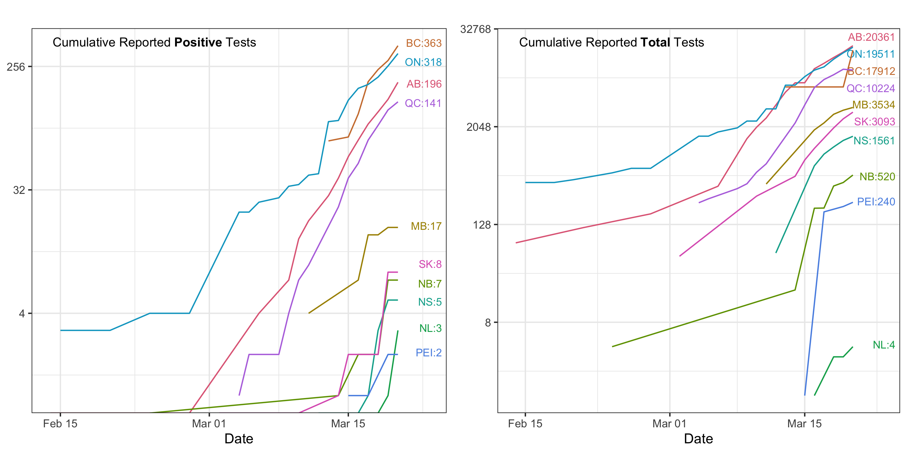

This is a public open-resource page for the COVID19 testing data for Canada. 

_last updated: March 18th 21:33 Toronto time_

## COVID19 Testing Data

This dataset is compiled from open sources and provincial level public health websites. 
The data will be updated daily around 22:00 Toronto time.

This dataset contains daily reported number of positive/negative confirmed cases, presumptive cases, under investigation, and sources. 

All data before March 14, 2020 are recovered using _Way Back Machine_, and inputted manually after March 14th. 

[Raw Data](https://github.com/wzmli/COVID19-Canada/raw/master/COVID-19_test.csv)

[Curated Data](https://github.com/wzmli/COVID19-Canada/raw/master/clean.Rout.csv)

## Testing status

_These plots are generated using the curated data_

## Contacts 

- Maintainer: Michael Li 
- Email: wzmichael.li@gmail.com
- Twitter: @MLiwz1
- [Github repo](https://github.com/wzmli/COVID19-Canada)

If there are questions about the data, please contact via email or add to the [github issues](https://github.com/wzmli/COVID19-Canada/issues). 

### Terms of Use:

This GitHub page and its contents herein, including all data, copyright 2020 McMaster University TheoBio Lab, all rights reserved, is provided to the public strictly for educational and academic research purposes.  The Website relies upon publicly available data from multiple sources, that do not always agree. The McMaster University TheoBio Lab hereby disclaims any and all representations and warranties with respect to the Website, including accuracy, fitness for use, and merchantability.  Reliance on the Website for medical guidance or use of the Website in commerce is strictly prohibited.

