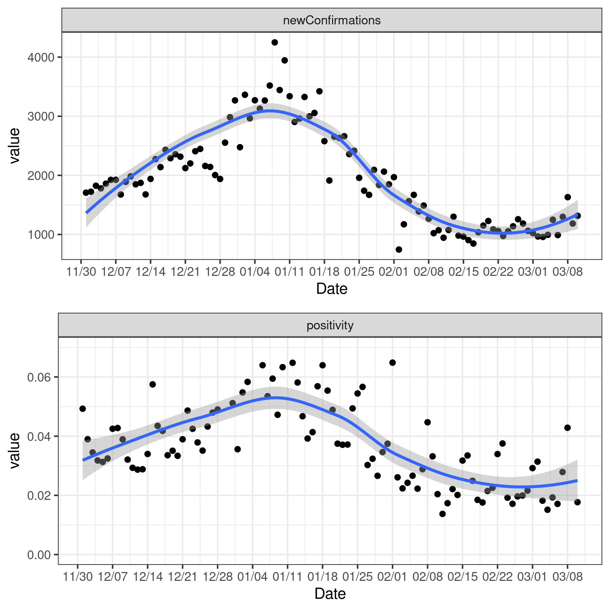
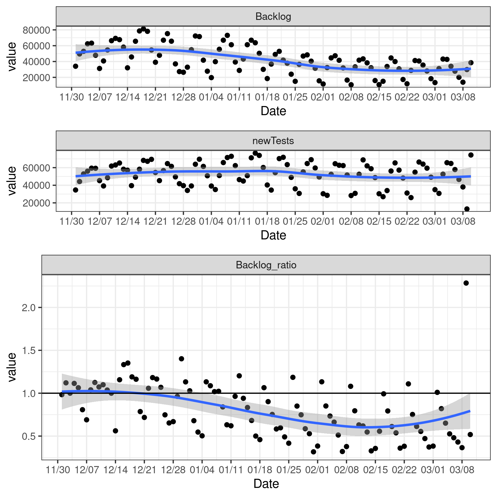
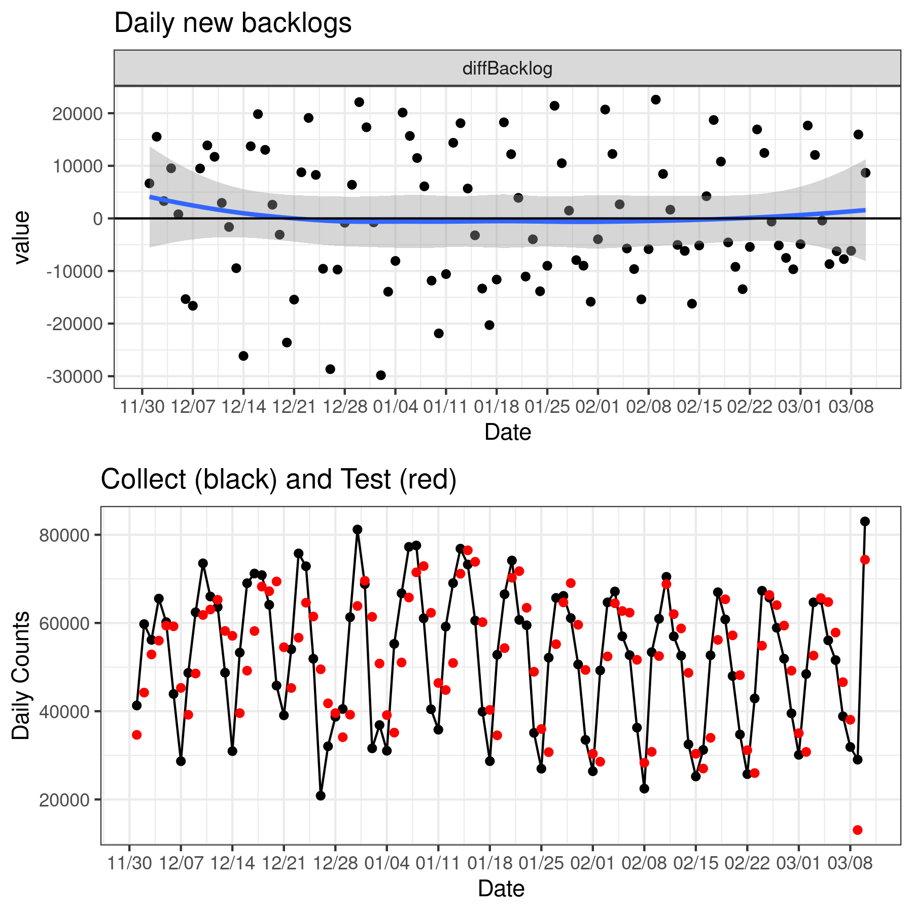

This is a public open-resource page for COVID19 data for Canada, 
maintained by [Michael Li](https://wzmli.github.io/) at McMaster University.

_last updated: Nov 7th 08:35 Toronto time_

## Ontario testing status

_These plots are generated using the curated data_ provided below.

## Hospitalization/ICU counts

Dashed red line represents current ICU capacity allocated to COVID, this line will adjust when we have more details on expansions. This line does not represent the general ICU capacity (which includes all non-COVID cases). The current ICU capacities used in the plot can be found in the [capacity data set](capacity.csv).

## COVID19 Data

All code is available on [the associated repo](https://github.com/wzmli/COVID19-Canada)

Our [*raw* data set](https://github.com/wzmli/COVID19-Canada/blob/master/COVID19_Canada.csv); [direct download](COVID19_Canada.csv) is compiled from available, open sources on the web – primarily provincial-level public health websites, and news reports. See [README](https://github.com/wzmli/COVID19-Canada/blob/master/README.md) for URLs.

We update once per day. 

This dataset contains daily reported number of positive/negative confirmed cases, presumptive cases, under investigation, and sources. 

New addition: We are adding in Hospitalization, ICU, and Ventilator counts when they are avaliable.

Data before March 14, 2020 were recovered using the [Way Back Machine](https://archive.org/web/); later data are gathered daily directly from the sites. 

## Curating Data

Our [*curated* data set](https://github.com/wzmli/COVID19-Canada/blob/master/git_push/clean.Rout.csv); [direct download](git_push/clean.Rout.csv)

* puts all of the information into a consistent format
* calculates daily new reported cases from cumulative cases
* corrects minor errors (using [this script](clean.R))

When possible we use summary reports from [the federal outbreak website](https://www.canada.ca/en/public-health/services/diseases/2019-novel-coronavirus-infection.html) to check our error correction

## Other Canadian COVID19 Resources

### National-level Public data

- [StatsCan detail line list](https://www150.statcan.gc.ca/t1/tbl1/en/tv.action?pid=1310076701)

### Provincial-level

- [Ontario line list](https://data.ontario.ca/dataset/confirmed-positive-cases-of-covid-19-in-ontario/resource/455fd63b-603d-4608-8216-7d8647f43350)
- [Ontario Population level Covid Data](https://data.ontario.ca/dataset/status-of-covid-19-cases-in-ontario)

### COVID-19 Canada Open Data Working Group

Epidemiological Data from the COVID-19 Outbreak in Canada

- [Github repo](https://github.com/ishaberry/Covid19Canada)
- [Public COVID-19 Canada Line list](https://docs.google.com/spreadsheets/d/1D6okqtBS3S2NRC7GFVHzaZ67DuTw7LX49-fqSLwJyeo/edit?usp=sharing)
- [shiny app](https://art-bd.shinyapps.io/covid19canada/)

## Contacts

- Maintainer: Michael Li 
- Email: wzmichael.li@gmail.com
- Twitter: @MLiwz1
- [Github repo](https://github.com/wzmli/COVID19-Canada)

If there are questions about the data, please contact via email or add a [github issue](https://github.com/wzmli/COVID19-Canada/issues). 

### Terms of Use

 This GitHub page and its contents herein, including all data, copyright 2020 McMaster University TheoBio Lab, all rights reserved, is provided to the public strictly for educational and academic research purposes.  The Website relies upon publicly available data from multiple sources, that do not always agree. The McMaster University TheoBio Lab hereby disclaims any and all representations and warranties with respect to the Website, including accuracy, fitness for use, and merchantability.  Reliance on the Website for medical guidance or use of the Website in commerce is strictly prohibited.

